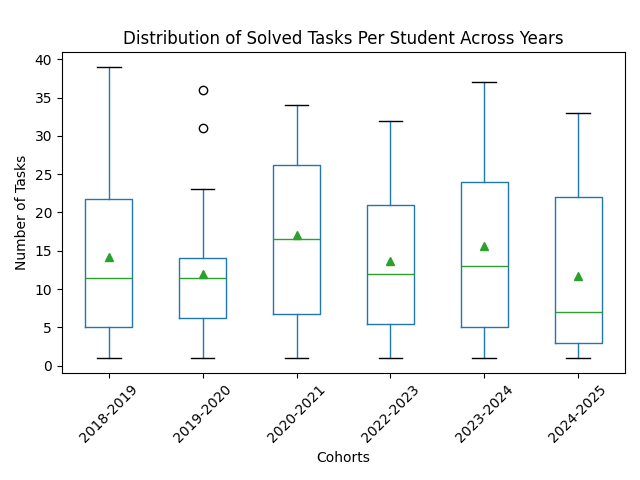
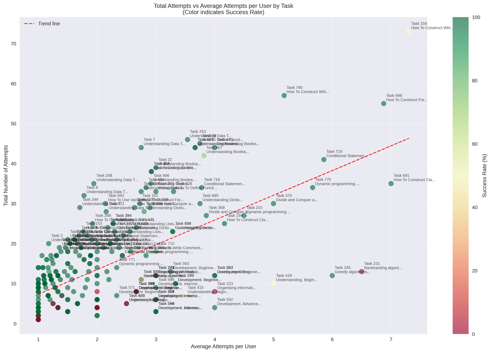

# Computational Thinking Course GitHub Analytics (2018-2025)

Analysis of student engagement in the [Computational Thinking and Programming course](https://www.unibo.it/en/study/phd-professional-masters-specialisation-schools-and-other-programmes/course-unit-catalogue/course-unit/2024/467045) through [GitHub data](https://github.com/comp-think) across different academic cohorts (2018-2025) at the University of Bologna's Digital Humanities and Digital Knowledge master's program.

This repository is part of my master's thesis project at the Digital Humanities and Digital Knowledge program, focusing on analyzing student engagement patterns to evaluate and improve interactive learning frameworks in programming education.


## Repository Structure
```
.
├── github_stats.ipynb  # Historical GitHub engagement analysis
├── analysis.ipynb  # Current timestamps data visualization
├── repo_data/
│   ├── 2018-2019.csv
│   ├── 2019-2020.csv
│   └── ...
├── data/
│   └── timestamps.json    # Current learning activity timestamps
└── README.md
```

## Analysis Overview

The repository contains two main analyses:

### 1. Historical GitHub Engagement (2018-2024)
- Number of unique users per academic year
- Distribution of student engagement
- Average comments/tasks per user
- Task completion distributions
- Engagement patterns across cohorts

### 2. Current Learning Activity Analysis (2024-2025)
The `analysis.ipynb` notebook provides insights into:
- Task completion patterns and success rates
- Daily learning activity trends
- Topic difficulty analysis based on solution times
- User progression through different topics

## Key Findings

The distribution of solved tasks per student across different cohorts shows interesting patterns:



This visualization shows:
- Consistent median task completion across years
- Varying levels of engagement between cohorts
- Presence of highly engaged outliers in some years


   - Each point represents a task, colored by success rate
   - X-axis shows average attempts per user
   - Y-axis shows total number of attempts
   - Tasks in the upper right require more attempts and may need review
   - Green points indicate high success rates despite multiple attempts